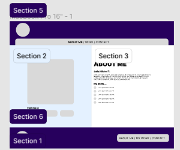

[CLICK **HERE** FOR SEE VISUAL](https://www.figma.com/file/6TbaLJu4Va4O9kETr2FENZ/My-Profile?type=design&node-id=0%3A1&mode=design&t=bsrbpc9DILIgIBoJ-1)

#Pages :

1. **About me**
2. **Work**
3. **Contact**

---

## Header

####Section 5 :

1. cirle Logo

2. **Nav Bar** inside a rectangle with **radius top r+l of 25px**

   - **ABOUT ME / WORK / CONTACT**

---

## Footer

####Section 6 :

1. Left : **cirle Logo**

2. Left: **JULIA MICHEL T. / mail adress / phone**

2. Right : **Nav Bar** inside a rectangle with **radius of 25px**

   - **ABOUT ME / WORK / CONTACT**

----

## About me (home)

#### Section 3

- **H1** : About me

- **H3** : Julia Michel T.

- **Paragraph**: A student in Junior Software Development at Becode, I aim to learn languages like Java, Python, and PHP. I aspire to develop APIs and have the ability to establish connections between different platforms. I'm not afraid to take on multiple projects simultaneously; I believe in embracing variety and diversifying experiences.

- **H3**: My skills

- Communication
- Self-taught
- Design skills
- Punctual
- Handles stress well

#### Section 2

1. **Picture** of Julia
2. **barre de réseaux sociaux** [Linkedin](Link) / [Facebook](Link) / [Instagram](Link)

## MY WORK 

#### Section 2

1. Slider with works

#### Section 3

- **H1** : CAN I USE YOUR TECH ?

- **H3** : I do what i want !

- **Paragraph**: Aspiring junior developer with a passion for coding and web development. Proficient in JavaScript, HTML, and CSS. Committed to learning, problem-solving, and collaboration. Excited to contribute innovative solutions to web projects.

- **Repeater Box** : 

1. [Make some search Engine](https://lens.google/#homework)

2. [I would like to be like Neil for my SEO](https://app.neilpatel.com/)

3. [Make a site you can chat in live like omegle](https://www.omegle.com/)

## CONTACT (home)

#### Section 3

1. **H1** : CONTACT

1. **H3** : Response within 48 hours

1. **Paragraph**: Your patience is greatly appreciated, and we look forward to assisting you. Please feel free to leave your message, and we will get back to you as soon as possible.

1. **barre de réseaux sociaux** [Linkedin](Link) / [Facebook](Link) / [Instagram](Link)

#### Section 2

1. **Contact Form** : CONTACT

1. **Name** : 

1. **Phone**: 

1. **Mail-adress**: 

1. **Let a message:**: 